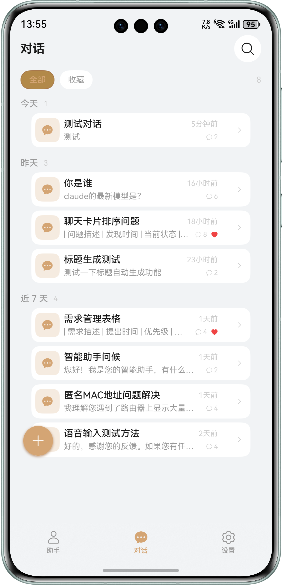
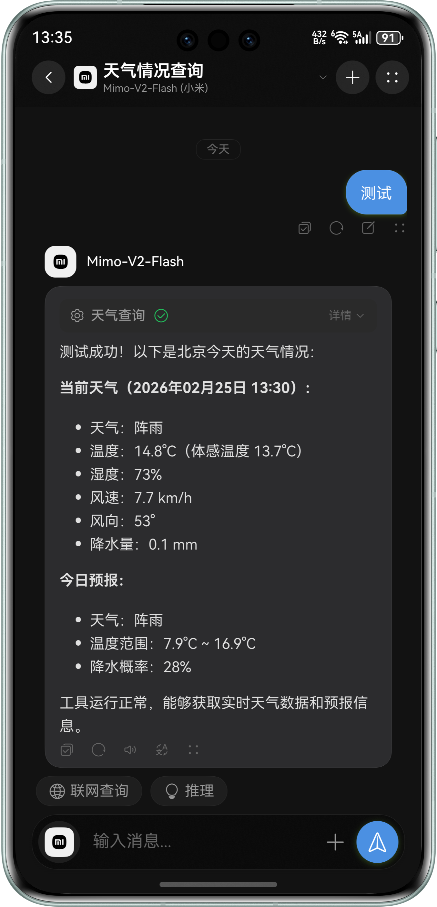
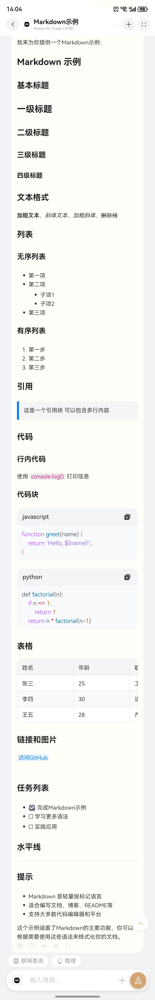
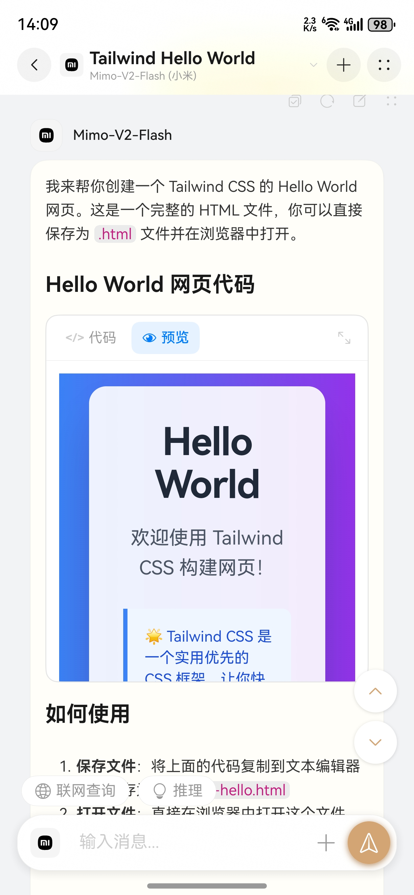
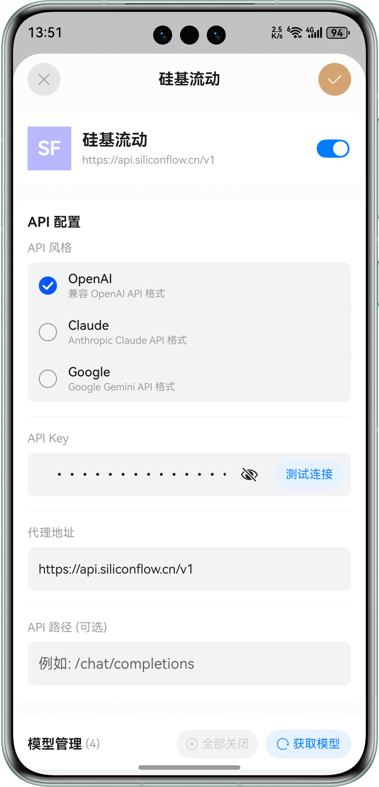
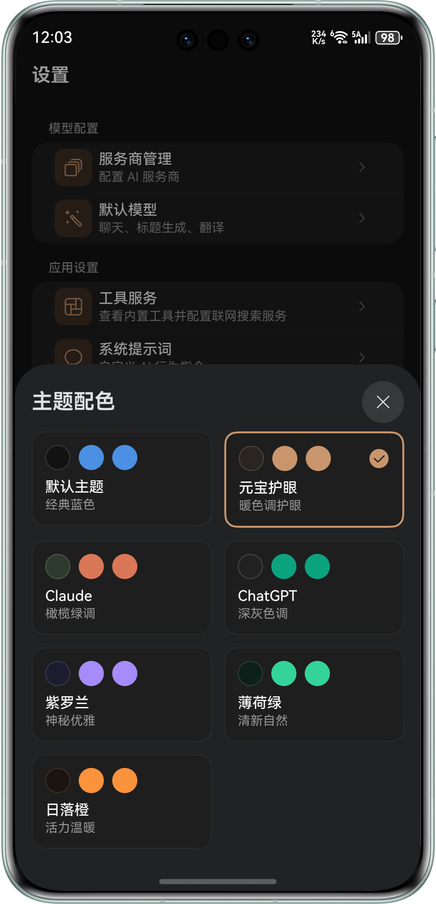
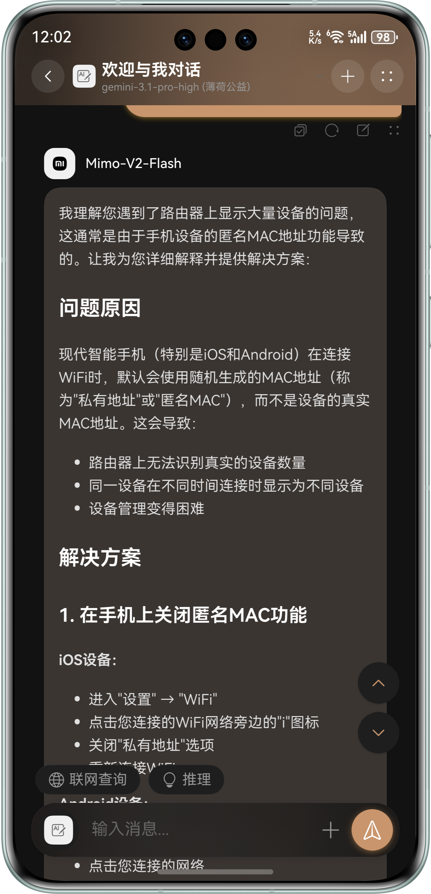
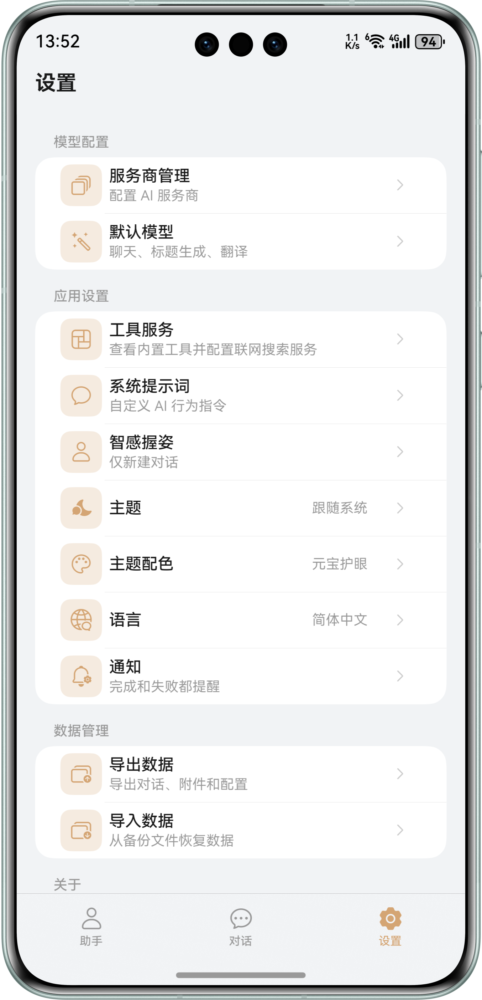

<p align="center">
  
</p>

<h1 align="center">ChatCube</h1>

<p align="center">
  一个开源的 HarmonyOS NEXT AI 聊天客户端。<br/>
  一个应用，13+ 服务商，原生体验。
</p>

<p align="center">
  <a href="./README.md">English</a> · <a href="./LICENSE">MIT License</a>
</p>

---

## 为什么选 ChatCube？

- 完全使用 ArkTS 原生开发，不是 WebView 套壳
- 界面精致，动态模糊、7 种配色主题、流畅交互
- 服务商高度自定义 — 几秒添加任何 OpenAI / Anthropic / Gemini 兼容服务
- 简单易上手 — 填个 API Key 就能开聊
- 桌面小组件，快速发起对话
- 后台任务支持 — 切到其他应用也不耽误接收回复

## 应用预览

<table>
  <tr>
    <td align="center"><br/><sub>对话</sub></td>
    <td align="center"><br/><sub>工具调用</sub></td>
    <td align="center"><br/><sub>Markdown 渲染</sub></td>
    <td align="center"><br/><sub>HTML 预览</sub></td>
  </tr>
  <tr>
    <td align="center"><br/><sub>服务商管理</sub></td>
    <td align="center"><br/><sub>配色主题</sub></td>
    <td align="center"><br/><sub>动态模糊</sub></td>
    <td align="center"><br/><sub>设置</sub></td>
  </tr>
</table>

## 功能特性

### 和任何模型对话

内置 13+ AI 服务商，填入 API Key 选个模型就能聊。支持自定义添加任何 OpenAI / Anthropic / Gemini 兼容的服务商，几秒搞定。

### 模型能用的工具

内置联网搜索（Bing，零配置）和天气查询（Open-Meteo，免费）。支持 Function Calling 的模型可以自主调用这些工具，获取实时信息。

### Markdown 及更多

完整的 Markdown 渲染 — 语法高亮代码块、表格、LaTeX 公式、图片。甚至原始 HTML 也能实时预览。

### 好看，好用

7 种配色主题，深色 / 浅色 / 跟随系统。实时动态模糊效果。原生 UI 的流畅感，因为它就是原生的。

### 智感握姿

检测你用哪只手握着手机，自动把「新对话」按钮移到够得着的一侧。单手操作，就该这么简单。

### 数据在你手里

导出和导入一切 — 对话、服务商配置、偏好设置。JSON 格式，没有锁定。

### 后台也不掉线

切到其他应用等待长回复？ChatCube 在后台继续工作，回复完成后通知你。

## 支持的服务商

| 服务商 | API 格式 | 说明 |
|--------|---------|------|
| OpenAI | OpenAI | GPT-4o、o1 等 |
| Claude | Anthropic | Claude 4、3.5 等 |
| DeepSeek | OpenAI 兼容 | DeepSeek-V3、R1 等 |
| Gemini | Google | Gemini 2.5 等 |
| Grok | OpenAI 兼容 | xAI 模型 |
| Ollama | OpenAI 兼容 | 本地模型 |
| OpenRouter | OpenAI 兼容 | 多服务商网关 |
| 硅基流动 | OpenAI 兼容 | 国产 AI 模型 |
| 阿里云百炼 | OpenAI 兼容 | 通义千问系列 |
| 智谱 AI | OpenAI 兼容 | GLM 系列 |
| 火山引擎 | OpenAI 兼容 | 豆包系列 |
| MiniMax | OpenAI 兼容 | MiniMax 模型 |
| AiHubMix | OpenAI 兼容 | 多服务商网关 |

……或者自己添加任何兼容的服务商。

## 快速开始

### 环境要求

- HarmonyOS NEXT（API 21+）
- DevEco Studio 5.0+

### 构建运行

```bash
git clone https://github.com/LongLiveY96/ChatCube.git
cd ChatCube
cp build-profile.json5.example build-profile.json5
# 编辑 build-profile.json5 填入你的签名配置
```

用 DevEco Studio 打开 → 同步 → 运行。

### 配置服务商

在应用中：**设置 → 服务商管理** → 添加你的 API Key。

## 项目结构

```
entry/src/main/ets/
├── components/         # 可复用 UI 组件
├── config/             # 应用和服务商配置
├── models/             # 数据模型
├── pages/              # 应用页面
├── services/           # 业务逻辑服务
├── viewmodels/         # ViewModel（MVVM）
├── utils/              # 工具函数
└── widget/             # 桌面小组件
```

## 许可证

[MIT](./LICENSE) — 随便用，开心就好。
